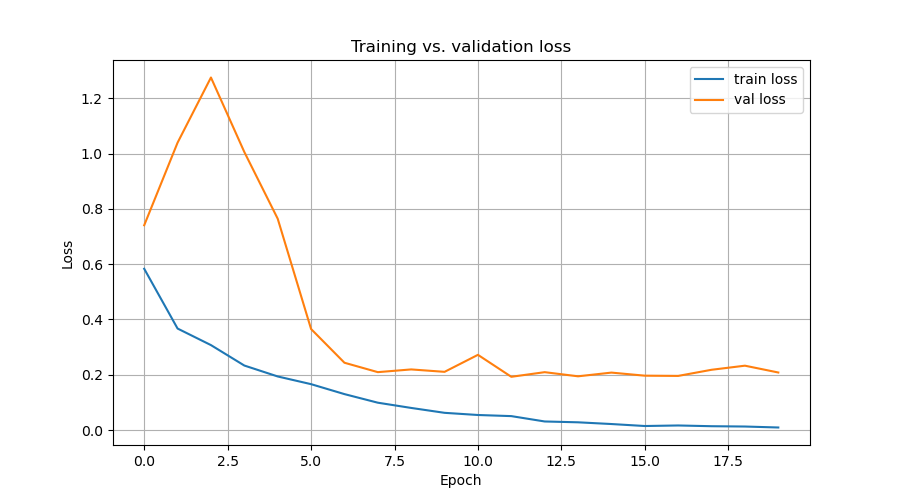
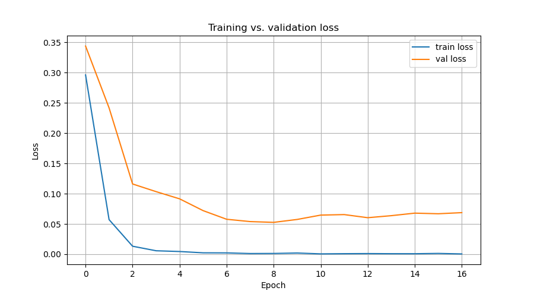

# Results

Two models on the same binary MRI tumor-detection task, same data, same
split, same seed. Everything below is reproducible with:

```bash
python scripts/train.py --config configs/default.yaml    # custom CNN
python scripts/train.py --config configs/resnet18.yaml   # ResNet-18
```

## Setup

| | |
|---|---|
| Dataset | 445 images — 213 tumor (`yes`), 232 healthy (`no`) |
| Split | 311 train / 89 val / 45 test, stratified, `seed: 42` |
| Input | 128×128 RGB, scaled to `[0, 1]`, no augmentation |
| Loss | `BCEWithLogitsLoss` on a single logit |
| Optimizer | AdamW, `lr 1e-4`, `weight_decay 1e-4` |
| Stopping | early stopping on val loss, `patience: 8`, cap `epochs: 70` |
| Device | CPU |

Both runs stop well short of the 70-epoch cap. That cap is a budget, not a
target — `patience` is what actually ends training.

## Headline numbers

Held-out test set (45 images), best-val-loss checkpoint:

| Model | Accuracy | F1 | ROC-AUC | Best epoch | Stopped at | Params | Wall clock |
|---|---|---|---|---|---|---|---|
| Custom CNN | 0.9111 | 0.9000 | 0.9802 | 12 | 20 | 2.34 M | 2m 21s |
| **ResNet-18** (ImageNet) | **0.9556** | **0.9524** | **0.9940** | 9 | 17 | 11.18 M | 4m 29s |

## Confusion matrices

45 test images: 21 tumor, 24 healthy.

| Model | TP | TN | FP | FN |
|---|---|---|---|---|
| Custom CNN | 18 | 23 | 1 | **3** |
| ResNet-18 | 20 | 23 | 1 | **1** |

This is the comparison that matters more than accuracy. Both models raise
exactly one false alarm, so the entire quality gap is in the false
negatives — missed tumors. The CNN misses 3 of 21; ResNet-18 misses 1.
In a screening context those two errors are not interchangeable, and the
single aggregate accuracy number hides the difference.

## Loss curves





Per-epoch values: [`reports/history_cnn.csv`](reports/history_cnn.csv),
[`reports/history_resnet18.csv`](reports/history_resnet18.csv).
Confusion matrix figures: `reports/confusion_matrix_cnn.png`,
`reports/confusion_matrix_resnet18.png`.

### Custom CNN — 20 epochs, best at 12

| epoch | train | val |
|---|---|---|
| 1 | 0.583183 | 0.740555 |
| 3 | 0.307217 | 1.274889 |
| 8 | 0.098953 | 0.209418 |
| **12** | **0.050426** | **0.192626** |
| 16 | 0.014630 | 0.196639 |
| 20 | 0.009262 | 0.208139 |

Val loss climbs to 1.27 by epoch 3 before finding its footing — the model
is learning from scratch and the first few epochs are unstable. From
epoch 8 on it oscillates in a 0.19–0.23 band and never sets a new floor,
while train loss keeps falling to 0.009. That widening gap is overfitting:
everything learned after epoch ~12 is specific to the 311 training images.

### ResNet-18 — 17 epochs, best at 9

| epoch | train | val |
|---|---|---|
| 1 | 0.296170 | 0.343876 |
| 3 | 0.013227 | 0.116050 |
| 6 | 0.002322 | 0.072007 |
| **9** | **0.001277** | **0.052643** |
| 13 | 0.001073 | 0.060336 |
| 17 | 0.000489 | 0.068709 |

Starts where the CNN ends up: epoch 1 val loss of 0.344 already beats
anything the CNN reaches before epoch 6. Train loss is essentially zero
(0.0013) by epoch 9 — the training set is fully memorized — yet val loss
is 3.7× lower than the CNN's best. Pretrained features generalize even
when the head has memorized the data.

## Comparison

**ResNet-18 wins on every metric**, and by more than the accuracy column
suggests. Its best val loss (0.0526) is roughly a quarter of the CNN's
(0.1926), and it gets there in 9 epochs instead of 12.

The reason is the dataset size. 311 training images is far too few to
learn good visual features from scratch, so the custom CNN spends its
early epochs building edge and texture detectors — which is exactly what
the val-loss spike to 1.27 looks like. ResNet-18 starts with those
features already learned from ImageNet and only has to fit a new head.
Transfer learning is doing the work here, not the extra capacity: the
ResNet has ~5× the parameters, which on data this small would normally
make overfitting *worse*, not better.

Cost: ResNet-18 takes ~1.9× longer per run on CPU (15.8 s/epoch vs 7.1 s)
and produces a 43 MB checkpoint against the CNN's 9.1 MB.

**Caveat on precision.** The test set is 45 images, so one image is worth
2.2 points of accuracy. The gap between these models is 2 images. The
direction is consistent across accuracy, F1, AUC and validation loss, so
the ranking is trustworthy — but treat "95.6% vs 91.1%" as approximate.
A proper comparison needs k-fold cross-validation, and none of these
numbers should be quoted as clinical performance.

## Next steps

Neither model is data-limited on architecture, both are limited on data:

1. **Augmentation** — flips, small rotations, intensity jitter. The
   cheapest real gain available, and it attacks the overfitting both
   loss curves show directly.
2. **K-fold cross-validation** — to get error bars instead of single
   point estimates from 45 test images.
3. **Threshold tuning** — 0.5 is arbitrary. Given that false negatives
   dominate the error profile, a lower threshold trades the cheap error
   (false alarms) for the expensive one (missed tumors).
4. **Fine-tune the full ResNet** — currently all layers train at a single
   `1e-4`. Discriminative learning rates, or freezing the early blocks,
   would likely help on a dataset this small.
